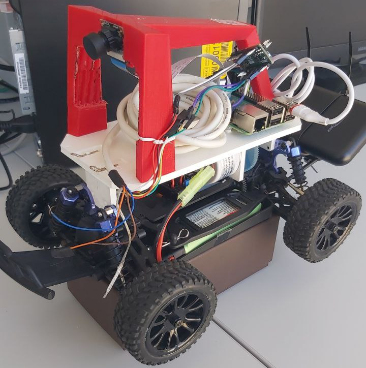

# Donkeycar

## What is about?

Donkeycar is minimalist and modular self driving library for Python. It is developed for hobbyists and students with a focus on allowing fast experimentation and easy community contributions.

## Our project

This project involves the use of a DonkeyCar to conduct experiments on Model Cooperative Driving Cars. Specifically, we are working on enabling the car to move autonomously using an OptiTrack system. Subsequently, each team member will contribute a part, such as adaptive cruise control, the use of LIDAR, communication between multiple cars, etc.

At the moment, the project is still in development, so the repository may undergo further changes.



## Repository structure

The repository is composed by 3 main folders:

- __mycar__ which contains the configuration files like myconfig.py and manage.py which are used to change the car performance and make it run

- __arduino__ which contains the code that is loaded on the arduino board
in order to control the encoder

- __donkeycar__ (not the repository itself) which contains all the files needed in order to run the car. The most important part for us is the subfolder __parts__. Here we put the real logic of the car.


This repository __must__ be cloned inside the donkeycar.

## Installation

### PC
To install the framework on a pc, you can entirely follow the <u>Developer install</u> on the website ([Ubuntu](https://docs.donkeycar.com/guide/host_pc/setup_ubuntu/), [Windows](https://docs.donkeycar.com/guide/host_pc/setup_windows/), [MacOS](https://docs.donkeycar.com/guide/host_pc/setup_mac/)), but clone this repository instead.

### DonkeyCar
To install the framework, follow the [DonkeyCar original instructions](https://docs.donkeycar.com/guide/robot_sbc/setup_raspberry_pi/) until the end of Step 3. 

At this point, to create the Virtual Environment, use [Miniconda](https://docs.anaconda.com/miniconda/). Remember to install the aarch64 version:
```
mkdir -p ~/miniconda3
wget https://repo.anaconda.com/miniconda/Miniconda3-latest-Linux-aarch64.sh -O ~/miniconda3/miniconda.sh
bash ~/miniconda3/miniconda.sh -b -u -p ~/miniconda3
rm ~/miniconda3/miniconda.sh
```

In order to avoid issues with the installation of the package `h5py` for ARM architecture, install it using conda:
```
conda install h5py
```

Then create the Virtual Environment and activate it:
```
conda create -n donkey python=3.11
conda activate donkey
```

Install the required libraries:
```
sudo apt install libcap-dev libhdf5-dev libhdf5-serial-dev
```

And finally clone this repository and install the framework using `pip`:
```
mkdir projects
cd projects
git clone https://git.manta.disi.unitn.it/mcdc/donkeycar
cd donkeycar
git checkout architecture_2
pip install -e .[pi]
```

## Other repositories

[MCDC Laptop](https://git.manta.disi.unitn.it/mcdc/mcdc-laptop/-/tree/natnetclient_c++) __must__ be installed on your pc/laptop in order to send the data received from the Optitrack to the correct car. In the branch `natnetclient_c++` there is the C++ program for using multiple cars at once.

[Mycar Giovanni](https://git.manta.disi.unitn.it/giovanni.pettinacci/mycar_with_original), branch `architecture_2`, has an example of `mycar` for using the Cooperative Collision Avoidance system. If you'll not use this repository, please create or get another `mycar`, or your vehicle will not work. Anyway, everything is described in the [official website](https://docs.donkeycar.com/guide/create_application/).

[Simulator](https://git.manta.disi.unitn.it/giovanni.pettinacci/simulation/) is a simulator that can be used to emulate multiple cars on top of Docker containerization (branch `multiple_cars`).

[MCDC Donkey](https://git.manta.disi.unitn.it/mcdc/mcdc-donkey) if you want to instert/update single Parts.

All the information needed are written in the readme file of the repository.


### Modify the flags in myconfig.py
You will find a functioning example of `myconfig.py` file in the repository [Mycar Giovanni](https://git.manta.disi.unitn.it/giovanni.pettinacci/mycar_with_original), branch `architecture_2`.

### Run the code
Go into your `mycar` directory and run:
```
python manage.py drive
```

## More informations

### Authors and acknowledgment
Contributors:
- Giorgia Lorengo
- Dorijan Di Zepp
- Giovanni Pettinacci
- Zakaria Aoukaili

Supervisors:
- Michele Segata
- Paolo Casari

### Project status
A first version of the collision avoidance system has been implemented. It works with multiple cars.

#### Quick Links
* [Donkeycar Updates & Examples](http://donkeycar.com)
* [Build instructions and Software documentation](http://docs.donkeycar.com)
* [Discord / Chat](https://discord.gg/PN6kFeA)

### More informations about Donkeycar

See [home page](http://donkeycar.com), [docs](http://docs.donkeycar.com)
or join the [Discord server](http://www.donkeycar.com/community.html) to learn more.
